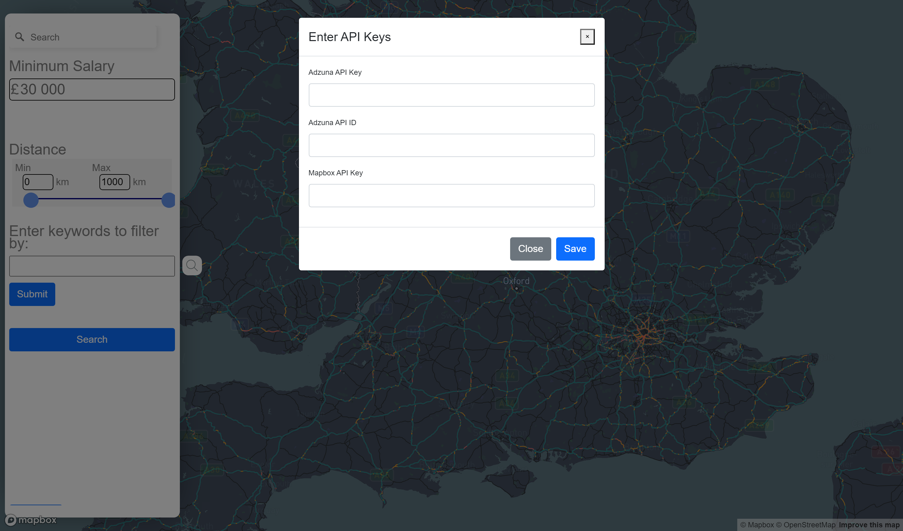
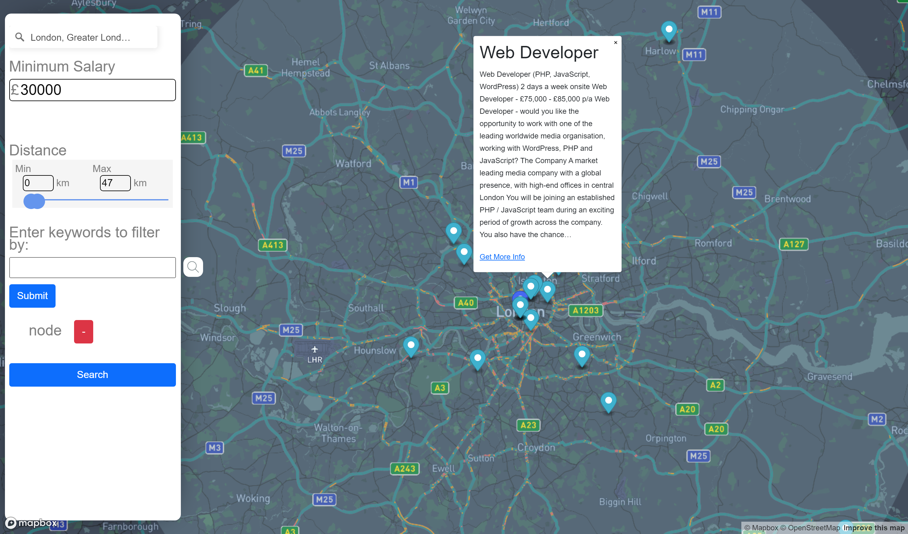

# Weather Dashboard

## Table of contents

- [Overview](#overview)
  - [The challenge](#the-challenge)
  - [Mock-up](#mock-up)
  - [Website](#website)
- [Our process](#our-process)
  - [Built with](#built-with)
  - [What we learnt](#what-we-learnt)

## Overview

### The challenge
This project is an interactive website that allows users to search for programming related jobs in the UK.

### Mock-up

The following image shows the web application's appearance and functionality:

### Website
Deployed application: https://yvonne0711.github.io/job-hunting/ 

**Note: The application needs to be cloned and you will need to enter the following details: Adzuna API Key, Adzuna API ID, Mapbox API Key.**

## Our process

### Built with
- HTML
- CSS
- Bootstrap
- JavaScript
- APIs (Mapbox API and Adzuna API)
- jQuery

### What we learnt
- Mapbox API for the map and search functionalities
- Adzuna API for the job listings
- overlaying Bootstrap components with the full screened map